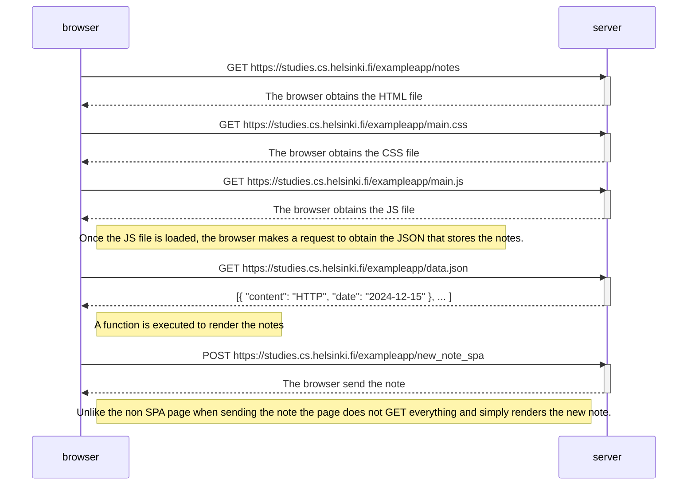

```mermaid
  sequenceDiagram
    participant browser
    participant server

    browser->>server: GET https://studies.cs.helsinki.fi/exampleapp/notes
    activate server
    server-->>browser: The browser obtains the HTML file
    deactivate server

    browser->>server: GET https://studies.cs.helsinki.fi/exampleapp/main.css
    activate server
    server-->>browser: The browser obtains the CSS file
    deactivate server

    browser->>server: GET https://studies.cs.helsinki.fi/exampleapp/main.js
    activate server
    server-->>browser: The browser obtains the JS file
    deactivate server

    Note right of browser: Once the JS file is loaded, the browser makes a request to obtain the JSON that stores the notes.

    browser->>server: GET https://studies.cs.helsinki.fi/exampleapp/data.json
    activate server
    server-->>browser: [{ "content": "HTTP", "date": "2024-12-15" }, ... ]
    deactivate server
    
    Note right of browser: A function is executed to render the notes

    browser->>server: POST https://studies.cs.helsinki.fi/exampleapp/new_note_spa
    activate server
    server-->>browser: The browser send the note
    deactivate server

    Note right of browser: Unlike the non SPA page when sending the note the page does not GET everything and simply renders the new note.
```